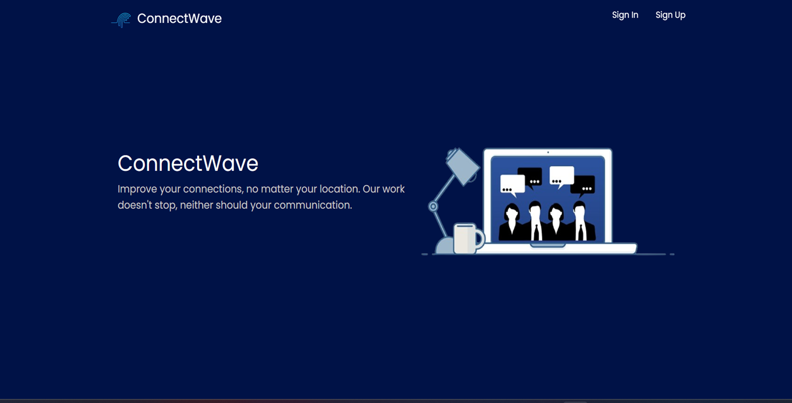
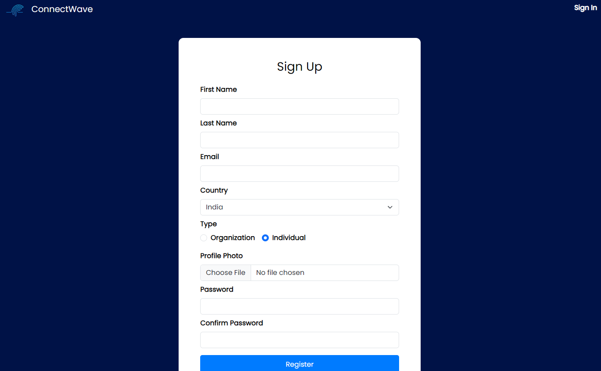
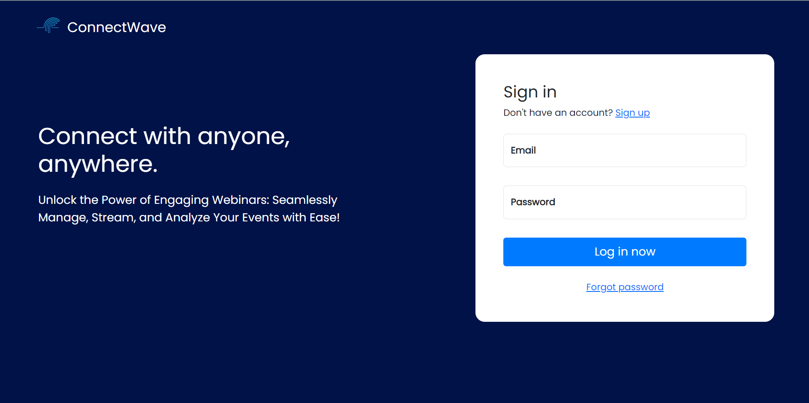
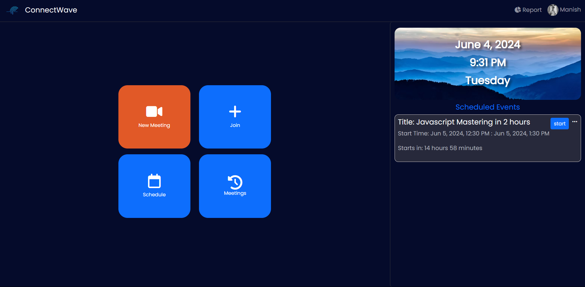
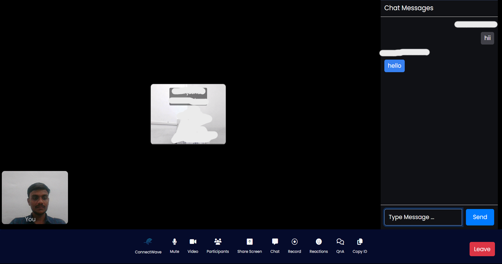

# ConnectWave: Online Webinar Website

A Real-Time, Interactive Webinar Platform

This project implements a user-friendly webinar solution built with the MERN stack (MongoDB, Express.js, React.js, and Node.js). It provides seamless virtual webinar experiences with high-definition audio and video, interactive features, and powerful tools for collaboration.

## Features

* **High-Quality Video and Audio:** Enjoy smooth webinars with exceptional audio and video quality.
* **Easy Scheduling and Joining:**  Effortlessly schedule and join webinars with simple, intuitive interfaces.
* **Real-Time Screen Sharing:** Share your screen instantly for interactive presentations and collaborative sessions.
* **Recording Capabilities:** Capture webinars for later viewing or sharing.
* **Interactive Engagement:** Keep participants engaged with real-time chat, emoji reactions, and Q&A sessions.

## Technologies

* **Frontend:** React.js (Vite)
* **Backend:** Node.js, Express.js
* **Database:** MongoDB
* **Real-Time Communication:** Socket.IO, WebRTC

## Getting Started

### 1. Prerequisites

* **Node.js and npm:** Make sure you have Node.js and npm (Node Package Manager) installed on your machine. Download from [https://nodejs.org/](https://nodejs.org/).
* **MongoDB:** Install and run MongoDB. You can download it from [https://www.mongodb.com/](https://www.mongodb.com/).
* **Git:** Install Git for version control.  [https://git-scm.com/](https://git-scm.com/)

### 2. Clone the Repository

```bash
git clone https://github.com/manish7532/ConnectWave
```

### 3. Setup Environment Variables
* Backend (.env file):  Create a file named .env in the root directory of the backend folder and add the following variables. Replace placeholders with your actual values:
```
MONGO_URI=YOUR_MONGO_URI
PORT=8000
SECRET=Your_Secret
EMAIL=Your_Email_FOR_SENDING_EMAILS
PASS=EMAIL_UNIQUE_PASS
```
* Frontend (.env file): Create a file named .env in the root directory of the frontend folder and add the following variable:
```
VITE_API_URL = 'your_backend_url' 
```

### 4. Install Dependencies

```bash
# Navigate to the backend directory
cd Backend

# Install backend dependencies
npm install

# Navigate to the frontend directory
cd Frontend

# Install frontend dependencies
npm install
```

### 5. Run the Project

* **Backend:**

   ```bash
   npm start
   ```

* **Frontend:**

   ```bash
   npm run dev
   ```

### 6. Screenshots








##  Authors

- [Manish Joshi](https://github.com/manish7532/)
- [Anushka Shewale](https://github.com/anushkas1204/)

## Support

For any questions, issues, or support, please contact manishjoshi0732@gmail.com or open an issue on the GitHub repository.